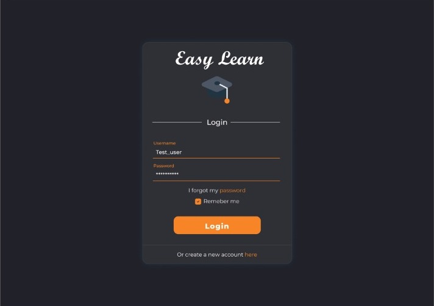
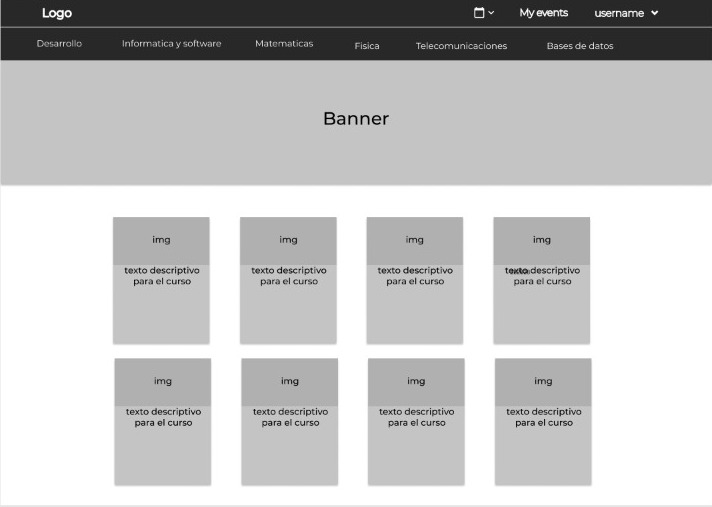

# Nombre del proyecto
Easy learn

## Problematica que atiende
Nuestro proyecto atiende a la comunidad de estudiantes que necesite ayuda con el entendimiento de un tema en especifico que no comprendieron en clase o que quieren 
aprender temas nuevos de su interes en tutorias.

## Propuesta de solución
Habilitar una plataforma web en la cual los usuarios pueden ver tutorias de los temas de tu agrado publicadas por otros usuarios, estas tutorias se mostratan como
eventos a los cuales puede asistir un alumno por medio de una link de Google meet y volver a visitar si le es necesario por medio de un link a youtube si el que
organizo la tutoria grabo la clase

## Definición de requerimientos del MVP
Pagina web que te permita subir y acudir a eventos a los usuarios (que cuentan con nombre, correo, contraseña y su configuracion de preferencias de contenido) 
mediante publicarlos con una fecha de realizacion, link de Google meet o un link de youtube en el caso de que ya se hayan sealizado esas tutorias

### Requerimientos funcionales
Páginas

Usuario
Si el usuario es nuevo, configural lo siguiente:
-Introducir preferencias (cuenta nueva sin preferencias) - Modal
-Usuario recomendados (usuarios con más seguidores dentro de tus preferencias)

Contenido para todas las vistas

Navbar - header
Eventos de gente a la que sigues (tipo notificaciones)
-Botón para crear evento (puede ser un div modal - popup)
-Drop down para acceder a la configuración (en la configuración se pueden cambiar las preferencias del contenido a visualizar, y la configuración del perfil) y para cerrar sesión.
-Buscador
Footer

Vistas
-Login
-Home
-Configuración
-Resultados del buscador
-Reproductor

Login
-Formulario de inicio de sesión o de registro (nuevo usuario)

Home (contenido a mostrar):
-Contenido (los vídeos) de las personas que sigues
-Algunas opciones relacionadas (como categorías)

Configuración
-Configuración general (foto de perfil, nombre, preferencias de contenido)

Resultados del buscador
-Resultados de la búsqueda
-Filtros 
  -Usuario
  -Eventos
  -Videos

Reproductor
-Video (embebido desde YouTube)
-Usuario

### Requerimientos no funcionales
Calidad
-Utilizar estilo de código definido por la comunidad (apoyarse en Rubocop)
-Utilizar SandiMeter para analizar el código y utilizar el resultado para hacer mejoras
-Presentación correcta en las versiones más recientes de los principales navegadores: Edge, Chrome, Safari y Firefox

Deployment
-Configuración de un servidor web (heroku o similar) para el deployment automático de actualizaciones de la app

Frontend
-CSS: libertad para utilizar cuaquier framework o librería, preferentemente SASS
  -Por ejemplo puedes utilizar Bootsrap junto con bootstrap_form para tus formularios

## Diseño del MVP

## Recursos

- [Minimum Viable Product](https://www.agilealliance.org/glossary/mvp/#q=~(infinite~false~filters~(tags~(~'mvp))~searchTerm~'~sort~false~sortDirection~'asc~page~1))
- [Minimum Viable Product (MVP)](https://www.productplan.com/glossary/minimum-viable-product/)
- [Design Thinking](https://www.interaction-design.org/literature/topics/design-thinking)
- [El proceso de pensamiento de diseño](https://www.youtube.com/watch?v=_r0VX-aU_T8)
- [Metodología Design Thinking. Ejemplos](https://www.youtube.com/watch?v=_ul3wfKss58) 
- [Design Thinking ejemplo sencillo](https://www.youtube.com/watch?v=_H33tA2-j0s)
